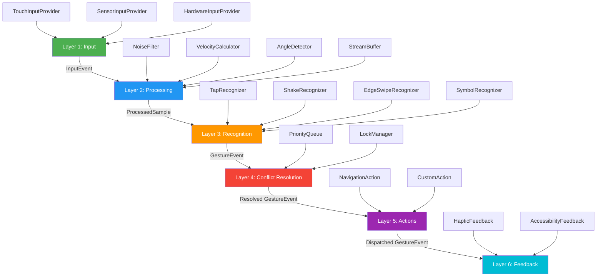

# @zeey4d/react-native-gesture-engine

[](https://www.npmjs.com/package/@zeey4d/react-native-gesture-engine)
[](https://opensource.org/licenses/MIT)
[](https://www.typescriptlang.org/)

A **modular, production-ready 6-layer event-driven gesture engine** for React Native. Supports touch, sensor, hardware, and sequence-based gestures with conflict resolution, action dispatch, and multi-modal feedback.

## ✨ Features

- 🏗️ **6-Layer Architecture** — Input → Processing → Recognition → Conflict Resolution → Action → Feedback
- 🎯 **12 Built-in Recognizers** — Tap, DoubleTap, Pan, Pinch, Rotation, EdgeSwipe, Corner, Shake, Tilt, WristFlick, Sequence, Symbol ($1 Unistroke)
- ⚡ **Event-Driven** — Typed pub/sub EventBus with compile-time channel→payload safety
- 🔒 **Conflict Resolution** — Priority queue + exclusive lock manager for gesture arbitration
- 📱 **Sensor Support** — Accelerometer & Gyroscope via expo-sensors with configurable intervals
- 🎮 **Haptic Feedback** — expo-haptics with Vibration fallback
- ♿ **Accessibility** — Automatic screen reader announcements
- 🪝 **React Hooks** — `useGestureEngine`, `useShakeGesture`, `useEdgeSwipe`, `useGestureSequence`
- 🧩 **Extensible** — Create custom recognizers by extending `BaseRecognizer`
- 🔋 **Battery-Conscious** — Throttled sensors, lazy initialization, ring buffer eviction

## 📦 Installation

```bash
npm install @zeey4d/react-native-gesture-engine
```

### Peer Dependencies

```bash
npm install react-native-gesture-handler react-native-reanimated expo-sensors
# Optional:
npm install expo-haptics
```

| Package | Version |
|---------|---------|
| `react` | >=18.0.0 |
| `react-native` | >=0.70.0 |
| `react-native-gesture-handler` | >=2.20.0 |
| `react-native-reanimated` | >=3.0.0 |
| `expo-sensors` | >=13.0.0 |
| `expo-haptics` | >=13.0.0 *(optional)* |

## 🚀 Quick Start

```tsx
import {
  GestureEngine,
  ShakeRecognizer,
  EdgeSwipeRecognizer,
  CustomAction,
  HapticFeedback,
} from '@zeey4d/react-native-gesture-engine';

// Create engine
const engine = new GestureEngine({
  sensorInterval: 100,
  hapticEnabled: true,
});

// Register recognizers
const shake = new ShakeRecognizer(engine.eventBus, { threshold: 1.5 });
engine.registerRecognizer(shake);

const edgeSwipe = new EdgeSwipeRecognizer(engine.eventBus, {
  edge: 'left',
  minDistance: 50,
  screenWidth: 400,
});
engine.registerRecognizer(edgeSwipe);

// Register actions
engine.registerAction('shake', new CustomAction('log', () => {
  console.log('Device shaken!');
}));

// Add feedback
engine.registerFeedback(new HapticFeedback());

// Start
engine.start();
```

## 🪝 React Hooks

### useGestureEngine

```tsx
import { useGestureEngine, ShakeRecognizer } from '@zeey4d/react-native-gesture-engine';

function App() {
  const { engine, isReady } = useGestureEngine({
    sensorInterval: 100,
    hapticEnabled: true,
    recognizers: [new ShakeRecognizer(eventBus, { threshold: 1.5 })],
    actions: { 'shake': [new CustomAction('alert', () => alert('Shaken!'))] },
  });

  return <View>{isReady && <Text>Engine Ready</Text>}</View>;
}
```

### useShakeGesture

```tsx
useShakeGesture({
  threshold: 1.5,
  cooldownMs: 1000,
  onShake: () => console.log('Device shaken!'),
});
```

### useEdgeSwipe

```tsx
useEdgeSwipe({
  edge: 'left',
  minDistance: 50,
  onSwipe: (event) => navigation.goBack(),
});
```

### useGestureSequence

```tsx
useGestureSequence({
  sequence: ['tap', 'tap', 'edge-swipe-right'],
  timeoutMs: 800,
  onComplete: () => console.log('Secret gesture unlocked!'),
});
```

## 🏛️ Architecture



## 📋 Recognizer Reference

| Recognizer | Type | Name | Key Config |
|------------|------|------|------------|
| `TapRecognizer` | Discrete | `tap` | `maxDuration`, `maxDistance` |
| `DoubleTapRecognizer` | Discrete | `double-tap` | `maxInterval`, `maxDistance` |
| `PanRecognizer` | Continuous | `pan` | `minDistance` |
| `PinchRecognizer` | Continuous | `pinch` | `minScale` |
| `RotationRecognizer` | Continuous | `rotation` | `minRotation` |
| `EdgeSwipeRecognizer` | Spatial | `edge-swipe-{edge}` | `edge`, `edgeZoneWidth`, `minDistance`, `minVelocity` |
| `CornerRecognizer` | Spatial | `corner-{corner}` | `corner`, `cornerZoneSize` |
| `ShakeRecognizer` | Sensor | `shake` | `threshold`, `consecutiveSamples`, `cooldownMs` |
| `TiltRecognizer` | Sensor | `tilt` | `tiltThreshold`, `cooldownMs` |
| `WristFlickRecognizer` | Sensor | `wrist-flick` | `angularVelocityThreshold`, `cooldownMs` |
| `SequenceRecognizer` | Sequence | `sequence:{names}` | `sequence[]`, `timeoutMs` |
| `SymbolRecognizer` | Symbolic | `symbol` | `templates`, `minConfidence` |

## 🧩 Custom Recognizer Guide

Extend `BaseRecognizer` to create your own:

```typescript
import { BaseRecognizer, ProcessedSample, IEventBus } from '@zeey4d/react-native-gesture-engine';

class LongPressRecognizer extends BaseRecognizer {
  private timer: ReturnType<typeof setTimeout> | null = null;
  private durationMs: number;

  constructor(eventBus: IEventBus, durationMs = 500) {
    super('long-press', eventBus, { priority: 15, isExclusive: true });
    this.durationMs = durationMs;
  }

  onProcessedSample(sample: ProcessedSample): void {
    if (!this.enabled) return;
    // Your recognition logic here...
    // Use: this.transitionToPossible(), this.transitionToBegan({ ... }), etc.
  }

  override reset(): void {
    super.reset();
    if (this.timer) clearTimeout(this.timer);
  }
}
```

### Available state transitions:
- `transitionToPossible()` — Gesture might be starting
- `transitionToBegan(metadata)` — Gesture recognized, emit event
- `transitionToChanged(metadata)` — Continuous gesture update
- `transitionToEnded(metadata)` — Gesture completed
- `transitionToFailed()` — Gesture didn't match
- `transitionToCancelled()` — Gesture interrupted

## ⚡ Performance Tips

1. **Sensor interval**: Use 100ms (10Hz) for battery efficiency. Only go to 16ms (60Hz) for real-time tracking.
2. **Lazy providers**: Sensor providers only subscribe when `start()` is called.
3. **Ring buffer**: `StreamBuffer` auto-evicts samples older than 400ms — O(1) per operation.
4. **Exclusive locks**: Conflict resolver stops redundant parallel processing.
5. **Ref-based hooks**: Engine lives outside React tree via `useRef` — no unnecessary re-renders.

## 🧪 Testing

```bash
npm test              # Run tests
npm run test:coverage # Run with coverage report
```

## 📄 License

MIT © [zeey4d](https://github.com/zeey4d)
# react-native-gesture-engine
